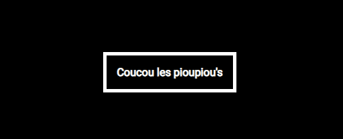

# Animations-drill
Je vais m'initié à l'animation avec du css.

## Cadre:
Cet exercice est effectué dans le cadre de ma deuxième semaine de formation au centre de formation BECODE. 
Nous sommes en janvier 2021.

## Technos utilisées:
HTML5
CSS3

## Auteurs: 
Juste moi :)

## Instructions:
Pour cet exercice je vais apprendre à faire des animations avec les propiétés animation et transition.

## But à atteindre :

## Statut:
terminé

## Projet déployé: 
Lien Github : https://github.com/RekhaLambotte/animations-drill.git

Lien web: 

## Remarques:

